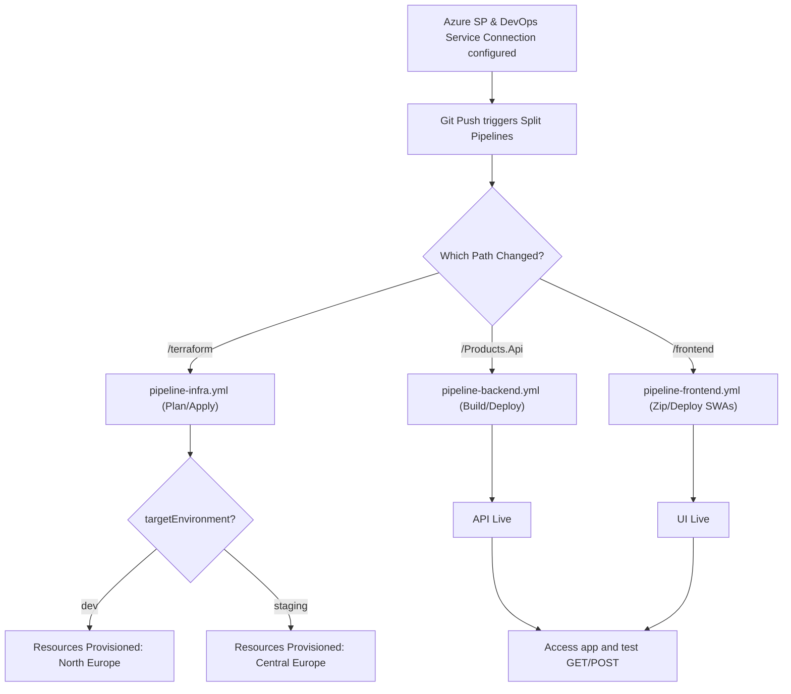

# Advanced Bootstrap Guide: .NET Web API, Tailwind CSS, Auth0, Modular Terraform, & Split CI/CD

Welcome to the advanced bootstrap guide for our modern Cloud-Native stack. This document is designed by a **Senior .NET Developer & Cloud Architect (15+ Years Experience)**. It outlines a production-ready, secure, and structured developer workflow to provision and build a .NET Web API authenticated by Auth0, backed by EF Core In-Memory, validated with FluentValidation, and styled with a lightweight Tailwind CSS frontend. All resources are managed via modular, **multi-environment** Terraform and deployed using split pipelines.

The Terraform code base is a single `main.tf` + `variables.tf` (no `.tfvars` files). Environment values are injected at run time through `TF_VAR_*` environment variables, which the infra pipeline sets based on the selected environment:

| Environment | `TF_VAR_ENVIRONMENT` | `TF_VAR_LOCATION` | Azure region |
| ----------- | -------------------- | ----------------- | ------------ |
| `dev`     | `dev`     | `northeurope` | **North Europe** |
| `staging` | `staging` | `westeurope`  | **Central Europe** |

> Note: Azure has no region literally named "Central Europe". `westeurope` (Amsterdam) is the canonical central/western European region; use `germanywestcentral` (Frankfurt) if you prefer a geographically-central region. Every module (`storage`, `key_vault`, `service_bus`, `web_app`) derives its location from the resource group, so selecting an environment deploys the **whole stack** to that region.

### Current Multi-Environment Contract

- Terraform uses one root configuration: `terraform/main.tf`, `terraform/variables.tf`, `terraform/providers.tf`, and `terraform/outputs.tf`.
- There is no `enviroments/` directory and there are no `.tfvars` files.
- Root Terraform variable names are UPPERCASE: `PROJECT_NAME`, `ENVIRONMENT`, `LOCATION`, `SUBSCRIPTION_ID`, `AUTH0_DOMAIN`, and `AUTH0_AUDIENCE`.
- Terraform environment-variable lookup is case-sensitive. For example, `TF_VAR_AUTH0_DOMAIN` binds to `variable "AUTH0_DOMAIN"`; `TF_VAR_auth0_domain` does not.
- The Azure DevOps infra pipeline exposes the queue-time `targetEnvironment` choice `dev` or `staging`.
- `dev` selects `azure-service-connection-dev`, `northeurope`, `dev-tenant.auth0.com`, and the `dev-infra` approval environment.
- `staging` selects `azure-service-connection-staging`, `westeurope`, `staging-tenant.auth0.com`, and the `staging-infra` approval environment.
- Both Terraform Plan and Apply receive `TF_VAR_ENVIRONMENT`, `TF_VAR_LOCATION`, `TF_VAR_AUTH0_DOMAIN`, and `TF_VAR_AUTH0_AUDIENCE`.
- `PROJECT_NAME`, `SUBSCRIPTION_ID`, and the other variables retain their defaults unless they are supplied through matching uppercase `TF_VAR_*` variables. Azure authentication is provided by the selected Azure DevOps service connection.

---

## Part 1: The Master Prompt (Context, Constraints, & Rules)

*Copy and use this Master Prompt at the start of every session or when seeding a new AI assistant to ensure all generated code complies with our professional engineering standards.*

```markdown
Role: Principal .NET Developer & Lead Cloud Infrastructure Architect (15+ years experience)
Context: We are bootstrapping a secure, scalable web application stack using .NET 10 Minimal APIs, Tailwind CSS, Auth0, and Terraform (Targeting Azure).
Environment: Multi-environment (dev + staging). No `.tfvars` files — the pipeline injects values via `TF_VAR_*` environment variables (e.g. `TF_VAR_ENVIRONMENT`, `TF_VAR_LOCATION`, `TF_VAR_AUTH0_DOMAIN`). Note: `TF_VAR_<NAME>` is case-sensitive, so the Terraform variables are declared in UPPERCASE to match. Local Terraform state (no remote/S3/Azure Blob backend for state). Target regions: dev -> northeurope (North Europe), staging -> westeurope (Central Europe).

Core Architectural Rules & Constraints:
1. **Clean Code & SOLID**: All C# code must use modern features (C# 13 / .NET 10), explicit typing (no 'var' unless the type is obvious on the same line, e.g., new()), and adhere to dependency injection.
2. **Minimal APIs**: Prefer organized Minimal APIs using group endpoints, with dedicated mapping classes rather than polluting `Program.cs`.
3. **Data Layer (EF Core)**:
   - Use Entity Framework Core InMemory provider for local dev (`Microsoft.EntityFrameworkCore.InMemory`).
   - Use the `IEntityTypeConfiguration<T>` pattern for entity configurations (e.g. key configurations, field lengths, and model seeds) rather than polluting `OnModelCreating`.
4. **Validation (FluentValidation)**:
   - Validate incoming requests using FluentValidation (`AbstractValidator<T>`).
   - Keep validation logic isolated from endpoints.
5. **Security First**: 
   - No hardcoded credentials, connection strings, or secrets.
   - Use environment variables (`Environment.GetEnvironmentVariable`) or `IConfiguration` for .NET.
   - Configure Auth0 authentication using JWT validation with strict issuer and audience checks.
   - Set up standard CORS policies restricting access to designated client origins.
6. **Error Handling & Centralized Mapping**: 
   - Handle exceptions globally using the `IExceptionHandler` interface to convert failures (validation errors, bad requests, invalid operations) to RFC 7807 Problem Details.
   - Ensure proper frontend validation and graceful error banners.
7. **Terraform Best Practices (Modular & Multi-Environment)**:
   - Separate code into modules: `storage` (S3/Blob container), `key_vault`, `service_bus` (namespaces & topics), and `web_app` (App Plan & Linux Web App).
   - Reference modules inside `/terraform/main.tf`. Use local state.
   - Keep a single `main.tf` + `variables.tf` — no `.tfvars` files. Supply per-environment values at run time via `TF_VAR_*` environment variables. Never hardcode region/environment in module code — always flow `location`/`environment` from variables so one code base serves every environment.
   - Target regions: `dev` -> `northeurope`, `staging` -> `westeurope`.
8. **DevOps Split Pipelines (Environment-Selectable)**:
   - Write separate pipelines for each layer: `pipeline-infra.yml` (Terraform Plan/Apply), `pipeline-backend.yml` (.NET Web API CI/CD), and `pipeline-frontend.yml` (Static Web App CD).
   - `pipeline-infra.yml` must expose a queue-time `targetEnvironment` parameter (`dev` / `staging`) that resolves the matching `TF_VAR_*` values, Azure service connection, and approval environment so operators can choose where to deploy.
```

---

## Part 2: The 11-Step Bootstrapping Guide & Individual Prompts

Below is the step-by-step breakdown to go from zero to a fully provisioned, secure, and running stack. Each step contains a targeted prompt you can feed into an AI coder to generate the required resources.

---

### Step 1: Azure Service Principal Creation
**Goal:** Create a Microsoft Entra ID (Azure AD) Service Principal to authenticate Terraform for provisioning Azure resources safely.

#### CLI Command to Run (Local Terminal)
```bash
# Login to Azure
az login

# Set active subscription
az account set --subscription "2a0fd781-da04-4038-9095-7b677ae5986a"

# Create the dev Service Principal with Contributor role
az ad sp create-for-rbac --name "terraform-dev-sp" --role Contributor --scopes /subscriptions/2a0fd781-da04-4038-9095-7b677ae5986a

# Create the staging Service Principal when environments use separate identities
az ad sp create-for-rbac --name "terraform-staging-sp" --role Contributor --scopes /subscriptions/2a0fd781-da04-4038-9095-7b677ae5986a
```

#### Step 1 Generation Prompt
```markdown
[System Instruction: Load Master Prompt]
Act as the Senior Architect. Generate a step-by-step setup guide for configuring local terminal environment variables to feed Azure Service Principal credentials to Terraform for both dev and staging. The guide must demonstrate how to configure these variables on Windows PowerShell, macOS/Linux bash, and VS Code `.env` files. Provide placeholder values for ARM_CLIENT_ID, ARM_CLIENT_SECRET, ARM_TENANT_ID, and ARM_SUBSCRIPTION_ID. Explain that Azure DevOps uses `azure-service-connection-dev` and `azure-service-connection-staging` instead of exposing credentials in pipeline YAML.
```

---

### Step 2: Terraform Baseline Architecture (Providers & Variables)
**Goal:** Set up the fundamental Terraform files (`providers.tf`, `variables.tf`, and `outputs.tf`) using a local state backend. No `.tfvars` files — per-environment values are supplied at run time via `TF_VAR_*` environment variables.

#### Step 2 Generation Prompt
```markdown
[System Instruction: Load Master Prompt]
Create the baseline Terraform structure inside a new folder named `/terraform`.
Generate:
1. `providers.tf`: Configure the `azurerm` provider (version ~> 3.90). Exclude the `backend` block (resulting in local backend usage).
2. `variables.tf`: Define UPPERCASE variables `ENVIRONMENT` (default: "dev"), `LOCATION` (default: "northeurope"), `PROJECT_NAME` (default: "yt-examples"), `SUBSCRIPTION_ID`, `AUTH0_DOMAIN`, and `AUTH0_AUDIENCE`. Names are UPPERCASE on purpose because `TF_VAR_<NAME>` env vars are case-sensitive and must match the variable name exactly. Do NOT create `.tfvars` files and do NOT hardcode region or environment in module resources — every environment-specific value must be overridable via its matching uppercase environment variable (`TF_VAR_ENVIRONMENT`, `TF_VAR_LOCATION`, `TF_VAR_AUTH0_DOMAIN`, and `TF_VAR_AUTH0_AUDIENCE`).
3. `outputs.tf`: Define outputs for Resource Group name, Static Web App URL, App Service API URL, Key Vault URI, and Service Bus Topic.
   Explain that a deployment targets an environment by exporting the relevant `TF_VAR_*` variables before running `terraform plan/apply` (dev -> northeurope, staging -> westeurope).
```

---

### Step 3: Modular Terraform Resource Provisioning
**Goal:** Restructure the infrastructure provisioning to use sub-modules (`storage`, `key_vault`, `service_bus`, `web_app`).

#### Step 3 Generation Prompt
```markdown
[System Instruction: Load Master Prompt]
Generate the directory structure and main configuration file `/terraform/main.tf` referencing the following modules:
1. `storage`: Provisions Azure Storage Account and container (S3/Blob equivalent).
2. `key_vault`: Provisions Azure Key Vault with basic tenant access policies.
3. `service_bus`: Provisions Service Bus namespace and a topic.
4. `web_app`: Provisions App Service Plan, Linux Web App (for the .NET API), and Static Web App.
Write the code to bind Resource Group properties to each module. Ensure all modules reside in `/terraform/modules/`. The root module must read `var.LOCATION` and `var.ENVIRONMENT`, then pass those values into each module's lowercase `location` and `environment` input arguments. This distinction is intentional: root variables are UPPERCASE to match `TF_VAR_*`, while child-module inputs may remain lowercase. Switching environments must deploy the entire stack to the selected region.
```

---

### Step 4: .NET Web API Project Initialization
**Goal:** Initialize a .NET 10 Web API project referencing JWT, EF Core InMemory, and FluentValidation packages.

#### Step 4 Generation Prompt
```markdown
[System Instruction: Load Master Prompt]
Provide instructions and files to initialize a C# .NET 10 Minimal API project named `Products.Api` using `dotnet new web`. 
Configure `Products.Api.csproj` to reference:
- `Microsoft.AspNetCore.Authentication.JwtBearer`
- `Microsoft.EntityFrameworkCore.InMemory`
- `FluentValidation`
- `FluentValidation.DependencyInjectionExtensions`
Provide a clean directory structure outline (Domain, Infrastructure/Data, Infrastructure/Errors, Endpoints, Endpoints/Validators).
```

---

### Step 5: Auth0 Tenant & API Configuration Guide
**Goal:** Document the exact setup instructions needed in the Auth0 Dashboard for both the API registration and SPA registration.

#### Step 5 Generation Prompt
```markdown
[System Instruction: Load Master Prompt]
Generate a highly detailed markdown manual showing how to set up Auth0 for our stack:
1. How to create an API in the Auth0 dashboard, including recommended identifier (Audience URL, e.g., `https://api.products.local`) and signing algorithm (RS256).
2. How to create a Single Page Application (SPA) client in Auth0, configuring the Allowed Callback URLs, Allowed Logout URLs, and Allowed Web Origins for local dev (e.g., `http://localhost:5000` or `http://127.0.0.1:5500`).
```

---

### Step 6: Auth0, EF Core, & Global Exception Handler Registration
**Goal:** Register DB context, FluentValidation services, global exception filters, and JWT configuration in `Program.cs`.

#### Step 6 Generation Prompt
```markdown
[System Instruction: Load Master Prompt]
Generate the complete setup code for `Program.cs` and `appsettings.Development.json` for our `Products.Api` project.
Requirements:
1. Register `AppDbContext` using `UseInMemoryDatabase("ProductsDb")`.
2. Scan assembly and register FluentValidation validators.
3. Add global exception handling using `AddExceptionHandler<GlobalExceptionHandler>()` and `UseExceptionHandler()`.
4. Configure JWT Bearer Authentication pointing Authority to Auth0 Domain and Audience to API Identifier.
5. Enable CORS policy allowing requests from designated local hostnames.
```

---

### Step 7: Domain, EF Configuration, Validators, & Product Endpoints
**Goal:** Implement the Product entity, db configurations with seeds, Fluent validators, and endpoints calling EF Core.

#### Step 7 Generation Prompt
```markdown
[System Instruction: Load Master Prompt]
Generate the core domain, data, validation, and endpoint mappings:
1. `Product.cs`: Positional C# record (`Id`, `Name`, `Price`, `Sku`, `CreatedAt`).
2. `ProductConfiguration.cs`: Implements `IEntityTypeConfiguration<Product>` configuring validation parameters and pre-seeding 3 dev products using `HasData`.
3. `CreateProductRequestValidator.cs`: Implements `AbstractValidator<CreateProductRequest>` validating name presence, positive price, and SKU rules.
4. `GlobalExceptionHandler.cs`: Centralized error filter converting unhandled exceptions, validation errors (throwing `ValidationException`), and logical exceptions into RFC 7807 Problem Details.
5. `ProductEndpoints.cs`: Routes mapping GET and secured POST product operations directly using `AppDbContext`.
```

---

### Step 8: Tailwind Frontend Setup & Auth0 SPA Client
**Goal:** Establish a single-page static HTML file, link it to the Auth0 SPA SDK and Tailwind CSS via CDN, and build the user interface frame.

#### Step 8 Generation Prompt
```markdown
[System Instruction: Load Master Prompt]
Create a modern, clean single-page app layout `index.html` using Tailwind CSS (via CDN) and the official Auth0 SPA SDK script (`@auth0/auth0-spa-js`). Include an add product button modal containing form fields.
```

---

### Step 9: Tailwind Frontend Auth State & Redirect Handlers
**Goal:** Connect the Auth0 login flow and profile management inside the frontend `app.js`.

#### Step 9 Generation Prompt
```markdown
[System Instruction: Load Master Prompt]
Generate JavaScript implementation inside `app.js` to manage the Auth0 redirection callback, login/logout buttons, user avatar metadata extraction, and retrieving access tokens.
```

---

### Step 10: API Integration & Data Sync
**Goal:** Fetch data from the .NET Web API and post new products, including the JWT access token in the authorization header.

#### Step 10 Generation Prompt
```markdown
[System Instruction: Load Master Prompt]
Complete `app.js` with functions to fetch products from `GET /api/products`, post creations to `POST /api/products` using silent access tokens, and show warning toast banners if a 401 Unauthorized is returned.
```

---

### Step 11: Separated Pipelines
**Goal:** Establish separate pipelines for infrastructure provisioning, backend service compilation, and frontend deployment.

#### Step 11 Generation Prompt
```markdown
[System Instruction: Load Master Prompt]
Generate three declarative Azure DevOps pipeline files:
1. `pipeline-infra.yml`: Triggers on changes to `/terraform` folder. Expose a queue-time `targetEnvironment` parameter with allowed values `dev` and `staging`. Use template expressions (`${{ if eq(...) }}`) to resolve `azure-service-connection-dev` / `azure-service-connection-staging`, `northeurope` / `westeurope`, and the `<env>-infra` approval environment. Run Terraform init, plan, and apply stages, with Apply protected by environment approvals. On both Terraform Plan and Apply task `env:` blocks, inject the exact case-sensitive names `TF_VAR_ENVIRONMENT`, `TF_VAR_LOCATION`, `TF_VAR_AUTH0_DOMAIN`, and `TF_VAR_AUTH0_AUDIENCE`. Do not use `-var-file`, `commandOptions`, or `.tfvars` files.
2. `pipeline-backend.yml`: Triggers on changes to `/Products.Api` folder, building, packaging, and deploying C# code to App Service.
3. `pipeline-frontend.yml`: Triggers on changes to `/frontend` folder, packaging and deploying SPA files to Static Web App.
```

---

## Part 3: Operational Verification Flow

After generating code using the steps above, follow this testing workflow to verify everything is operational:



### 1. Local Verification (Dev Sandbox)
Before deploying to Azure DevOps, you can run the services locally:
- Run Terraform locally to provision resource handles. Select the environment by exporting `TF_VAR_*` variables (no `.tfvars` files):
  ```bash
  cd terraform
  terraform init

  # Dev -> North Europe (bash / macOS / Linux)
  export TF_VAR_PROJECT_NAME="yt-examples"
  export TF_VAR_ENVIRONMENT="dev"
  export TF_VAR_LOCATION="northeurope"
  export TF_VAR_AUTH0_DOMAIN="dev-tenant.auth0.com"
  export TF_VAR_AUTH0_AUDIENCE="https://api.products.local"
  terraform plan
  terraform apply -auto-approve
  ```
  ```powershell
  # Staging -> Central Europe (Windows PowerShell)
  $env:TF_VAR_PROJECT_NAME   = "yt-examples"
  $env:TF_VAR_ENVIRONMENT    = "staging"
  $env:TF_VAR_LOCATION       = "westeurope"
  $env:TF_VAR_AUTH0_DOMAIN   = "staging-tenant.auth0.com"
  $env:TF_VAR_AUTH0_AUDIENCE = "https://api.products.local"
  terraform plan
  terraform apply -auto-approve
  ```
  > Tip: because state is local, isolate each environment's state to avoid clobbering the other, e.g. `terraform workspace new staging` (then `select`), or pass a separate `-state=terraform.<env>.tfstate` per environment.
- Run C# Web API locally:
  Set environment variables:
  - `Auth0__Domain="your-tenant.auth0.com"`
  - `Auth0__Audience="https://api.products.local"`
  Run:
  ```bash
  dotnet run --project Products.Api
  ```
- Run Frontend locally:
  ```bash
  npx serve .
  ```

### 2. CI/CD Pipeline Verification
1. Create environment-specific **Variable Groups** in Azure DevOps when real Auth0 values or secrets must not be stored in YAML, for example `dev-environment-secrets` and `staging-environment-secrets`.
2. Setup one **Service Connection** (Azure Resource Manager) per environment using the Service Principal(s) from Step 1: `azure-service-connection-dev` and `azure-service-connection-staging`.
3. Create the matching **Environments** in Azure DevOps for approval gates: `dev-infra` and `staging-infra`.
4. Add approval checks to each Azure DevOps environment as required.
5. Commit and push the split pipeline configurations, then register them in the Azure DevOps Pipelines hub.
6. Click **Run pipeline** for `pipeline-infra.yml` and select `targetEnvironment` as `dev` or `staging`.
7. Confirm in the Terraform Plan that the resource group and every module use `northeurope` for dev or `westeurope` for staging before approving Apply.
8. The pipeline resolves the service connection, approval environment, and exact uppercase `TF_VAR_*` values automatically. It never loads a `.tfvars` file.
