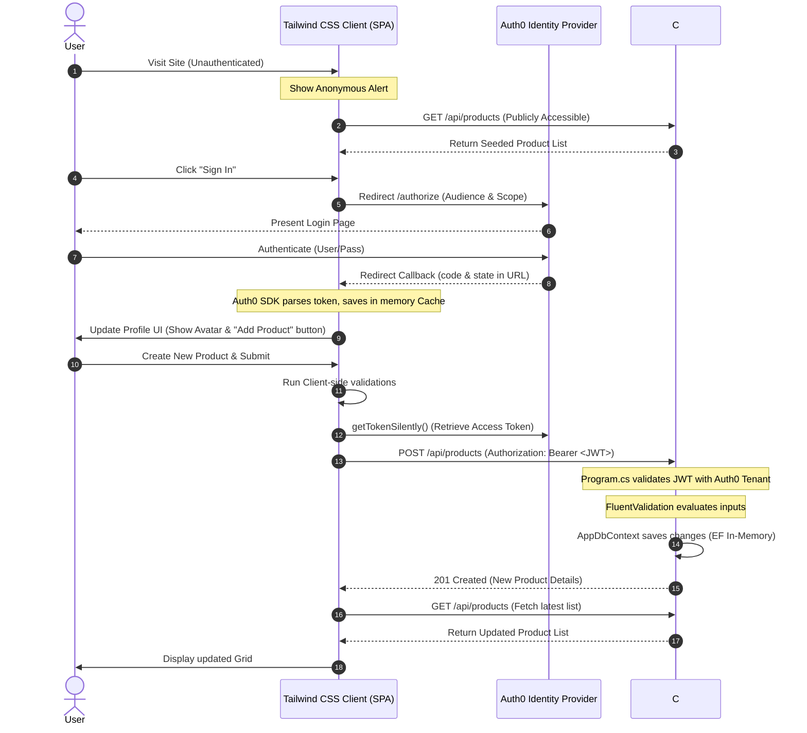

# Support Guide: Frontend & Backend Integration

This guide provides architectural and diagnostic details about the communication, authentication, and integration flows between the Tailwind CSS Frontend SPA and the C# .NET 10 Web API.

---

## 1. Architectural Communication Model



---

## 2. Authentication Flow & Token Lifecycle

### Requesting JWT Tokens
When the Frontend calls `POST /api/products`, it performs the following javascript flow in `app.js`:
1. Checks authentication status using `auth0Client.isAuthenticated()`.
2. Requests an access token silently:
   ```javascript
   const token = await auth0Client.getTokenSilently();
   ```
3. Injects it into the HTTP headers:
   ```javascript
   const response = await fetch(`${apiBaseUrl}/api/products`, {
     method: "POST",
     headers: {
       "Content-Type": "application/json",
       "Authorization": `Bearer ${token}` // Bearer Token
     },
     body: JSON.stringify(payload)
   });
   ```

### Backend JWT Validation
In the .NET Web API, `Program.cs` configures the validation using `Microsoft.AspNetCore.Authentication.JwtBearer`:
- **Authority:** Validates the token issuer against your Auth0 Tenant Domain (`https://your-tenant.auth0.com/`).
- **Audience:** Matches the target audience against the API Identifier (`https://api.products.local`).
- **Signature:** Auto-fetches the JWKS (JSON Web Key Set) signing keys from Auth0 metadata endpoint to verify signature authenticity.

---

## 3. Custom Error Handling (RFC 7807 problem details)

The .NET API includes a centralized `GlobalExceptionHandler` implementing `IExceptionHandler`. This catches all unhandled execution exceptions and converts them into standardized problem detail structures.

| Exception Class | Response Status | Problem Details Title | Trigger Cause |
| :--- | :--- | :--- | :--- |
| `FluentValidation.ValidationException` | `400 Bad Request` | Validation Failed | Input validation rules failed (SKU empty, Price <= 0) |
| `InvalidOperationException` / `ArgumentException` | `400 Bad Request` | Bad Request | Logical errors or invalid arguments passed |
| Generic `Exception` | `500 Internal Server` | Internal Server Error | Unhandled runtime code failures |

### Example Validation Fail Output:
```json
{
  "type": "https://tools.ietf.org/html/rfc7231#section-6.5.1",
  "title": "Validation Failed",
  "status": 400,
  "detail": "One or more validation errors occurred.",
  "instance": "/api/products",
  "errors": {
    "Price": [
      "Product price must be greater than 0."
    ]
  }
}
```

---

## 4. Diagnostics & Troubleshooting

### CORS Policy Issues
If the frontend browser console displays:
> Access to fetch at '...' from origin '...' has been blocked by CORS policy.

* **Cause:** The origin URL of your frontend host (e.g. `http://localhost:5000` or the Static Web App URL) is not whitelisted by the API.
* **Resolution:** Open [Program.cs](file:///d:/YouTube_Projects/YouTubeExamples/Terraform-Azure-Web-API/Products.Api/Program.cs#L14) and verify that the origins array inside `AddCors` policy contains the exact client scheme and port.

### 401 Unauthorized Responses
If calls to `POST /api/products` return a 401:
* **Cause 1:** The `Authorization` header is missing or improperly formed (must match `Bearer <token>`).
* **Cause 2:** The configuration settings for `Auth0:Domain` or `Auth0:Audience` in `appsettings.json` do not match the values configured on Auth0 Dashboard, or do not match the variables configured on the client SPA client.
* **Cause 3:** The Auth0 SPA client is fetching tokens for a different audience value. Verify the `audience` property matches exactly on both client and API.
